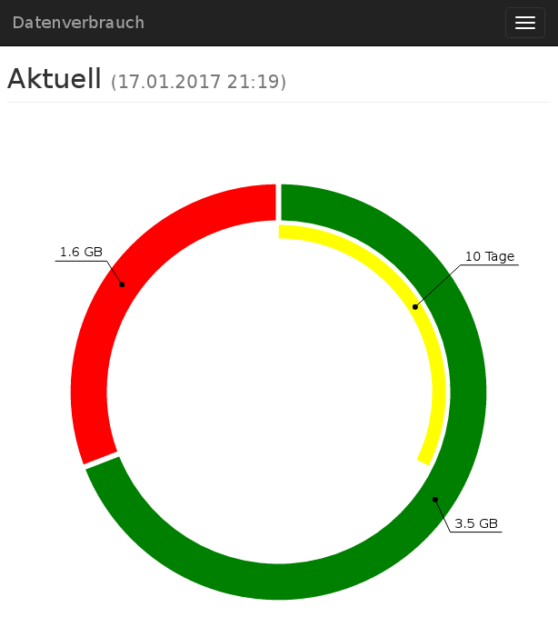

# simple website for [section77/datenverbrauch](https://github.com/section77/datenverbrauch)

`section77/datenverbrauch` pulls every hour our data-usage from the provider website and save it in a csv file.
This website displays the extracted data from the generated csv.

<svg xmlns="http://www.w3.org/2000/svg" xmlns:xlink="http://www.w3.org/1999/xlink" height="80">
<rect y="10" width="10" height="10" style="fill:red"/>    <text x="20"  y="20" >used</text>
<rect y="30" width="10" height="10" style="fill:green"/>  <text x="20"  y="40" >available</text>
<rect y="50" width="10" height="10" style="fill:yellow"/> <text x="20"  y="60" >days left</text>
</svg>

### Actual Usage

### History

